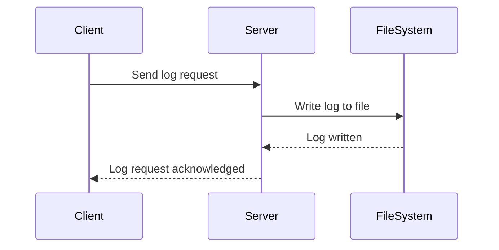
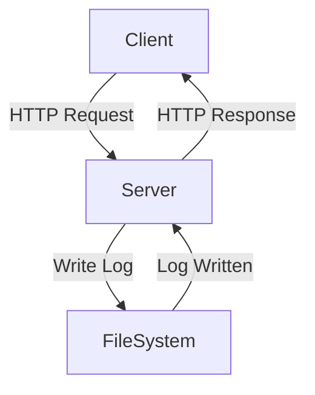

# Design Document for vsimplelogger

## Sequence Diagram


```mermaid
sequenceDiagram
    participant Client
    participant Server
    participant FileSystem

    Client->>Server: Send log request
    Server->>FileSystem: Write log to file
    FileSystem-->>Server: Log written
    Server-->>Client: Log request acknowledged
```

## Functional Block Diagram


```mermaid
flowchart TD
    A[Client] -->|HTTP Request| B[Server]
    B[Server] -->|Write Log| C[FileSystem]
    C[FileSystem] -->|Log Written| B[Server]
    B[Server] -->|HTTP Response| A[Client]
```
```
